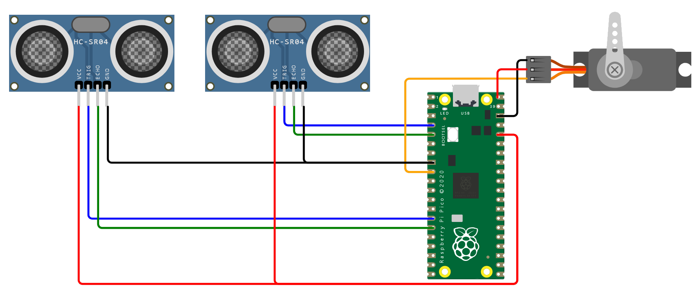

# Ultrasonic Fire Control Radar

A toy fire control radar which could track an object automatically, made with Raspberry Pi's RP2040.


Check the video to see how it works:

[](https://www.youtube.com/watch?v=v5ylTw5suUg)

## Hardware

| Part                            | Quantity |
| ------------------------------- | -------- |
| Raspberry Pi's RP2040 MCU board | 1        |
| HC-SR04 ultrasonic sensor       | 2        |
| Servo SG90 9g (180 Degree)      | 1        |



Pin connections:

| RP2040 | Component               |
| ------ | ----------------------- |
| `GP2`  | Right ultrasonic `TRIG` |
| `GP3`  | Right ultrasonic `ECHO` |
| `GP6`  | Servo signal (PWM)      |
| `GP10` | Left ultrasonic `TRIG`  |
| `GP11` | Left ultrasonic `ECHO`  |

## Algorithm

The HC-SR04 ultrasonic sensor has 15-degree measuring angle. So if we make the detection range of the 2 sensors slightly overlapped, we can calculate the accurate position of the target on the 2D surface:


We place the left sensor $L$, right sensor $R$ and servo $S$ (with an aiming sheriff doll) as below:


Now we know the distance between the 2 sensors as $\overline{LR}$, the distance between the right sensor and the servo as $\overline{RS}$. And we can detect the distance from sensors to target as $\overline{LT}$ and $\overline{RT}$. So we calculate the angle $\angle L$ with cosine law:

```math
\cos L = \frac{\overline{LT}^2 + \overline{LR}^2 - \overline{RT}^2}{2 \times \overline{LT} \times \overline{LR}}
```

Then calculate the distance from servo to target $\overline{ST}$ with cosine law:

```math
\overline{ST} = \sqrt{\overline{LT}^2 + \overline{LS}^2 - 2 \times \overline{LT} \times \overline{LS} \times \cos L}
```

At last, we can calculate the angle $\angle S$ to set the servo with sine law:

```math
\sin S = \frac{\overline{LT} \times \sin L}{\overline{ST}}
```

## Configuration

You may need to correct below configurations with the actual measurements (in cm).

```cpp
const double D_LR = 8.9;   // distance between 2 sonars (Rx)
const double D_RS = 10.6;  // distance between right sonar (Rx) and servo
```

## Dependencies

This project depends on below Arduino libraries:

- `DistanceSensor` by Segilmez06

## External Links

Tutorial

- [为黑猫警长制作电扫相控阵火控雷达 (Chinese)](https://post.smzdm.com/p/al8evkr0/)