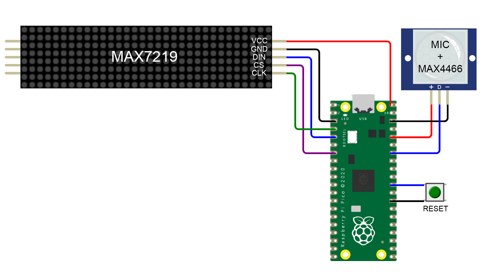

# 32-Band Audio Spectrum Visualizer

A 32-band audio spectrum visualizer, made with Raspberry Pi's RP2040. It can pick up and analyze the spectrum through an electret microphone. Just place this gadget near your audio speaker, it could visualize the spectrum on a 32x8 LED dot matrix display at 70 fps.


The sampling rate is 32kHz, but only the <24kHz part will be displayed for better visual effect.

Check the video to see how it works:

[](https://www.youtube.com/watch?v=xeoi0uXBLIc)

## Hardware

Parts:

- Raspberry Pi's RP2040 MCU board
- Electret Microphone Amplifier Module MAX4466 with Adjustable Gain
- MAX7219 Dot Matrix Module 4-in-1 Display



Pin connections:

| RP2040          | Component     |
| --------------- | ------------- |
| `GP2`           | MAX7219 `CLK` |
| `GP3`           | MAX7219 `DIN` |
| `GP5`           | MAX7219 `CS`  |
| `VBUS`          | MAX7219 `VCC` |
| `GND`           | MAX7219 `GND` |
| `GP28` / `ADC2` | MAX4466 `OUT` |
| `3V3(OUT)`      | MAX4466 `VCC` |
| `GND`           | MAX4466 `GND` |

## Calibration

It is better to perform calibration for your audio source before use:

1. Set below constant to `true` to enable calibration mode:

   ```cpp
   constexpr bool CALIBRATION = true;
   ```

2. Upload the sketch to RP2040, then place the microphone to a proper place near your speaker.

3. Play this [calibration audio](media/calibration.mp3) repeatedly from your speaker, with normal volume.

4. Connect the serial monitor of the Arduino IDE to RP2040 with `921600` baudrate.

5. Reset the RP2020, and keep quite during the calibration audio playback. The calibrated equalization values will be printed to the serial monitor after a while.

6. Replace the values in `EQ` array with the calibrated values:

   ```cpp 
   static double EQ[NUM_BANDS]{
     ...
   };
   ```

7. Change the `CALIBRATION` back to `false`, then upload the calibrated sketch.

## Dependencies

This project depends on below Arduino libraries:

- `arduinoFFT` by Enrique
- `MD_MAX72XX` by majicDesigns

## External Links

Tutorial

- [24元自制32段音乐频谱显示器 (Chinese)](https://post.smzdm.com/p/aqqg569x/)